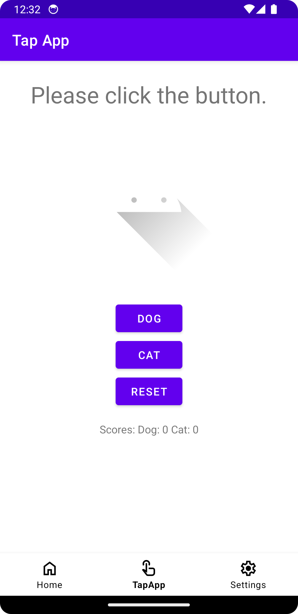
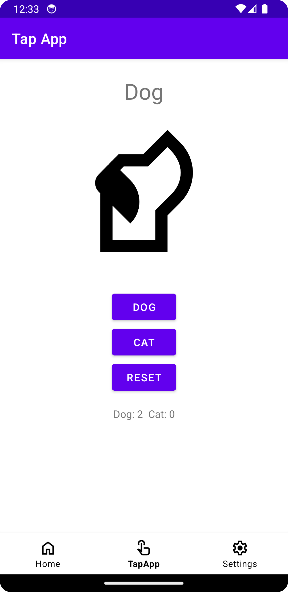
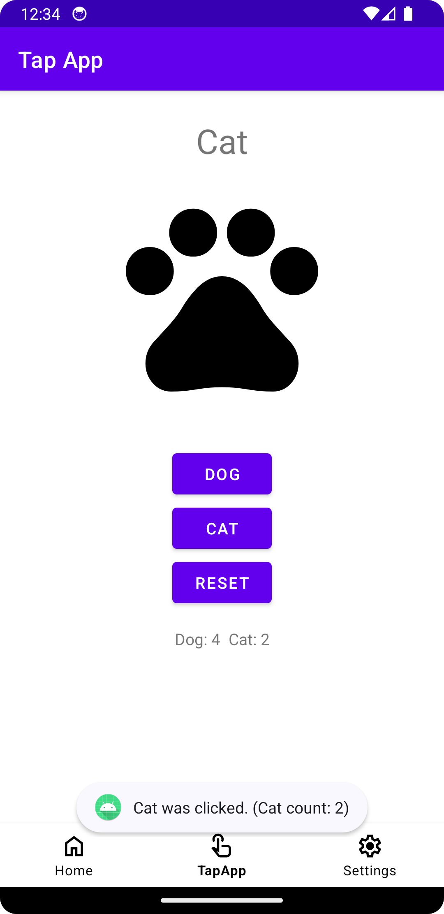
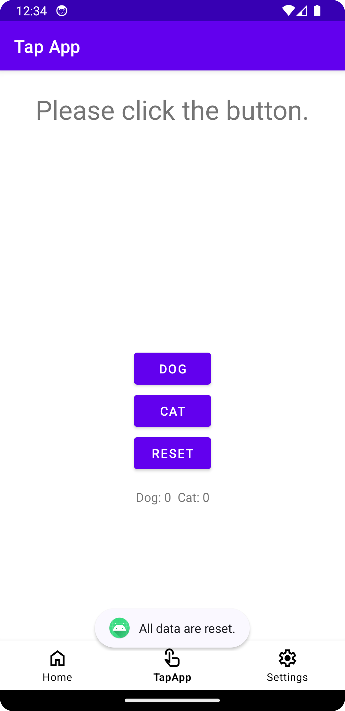

## Kotlin 簡単なタッチアプリ
このAndroidアプリは、シンプルなタッチベースのゲームで、ユーザーが異なる動物（犬と猫）を表すボタンをクリックできるようにします。
アプリは各ボタンがクリックされた回数を追跡し、選択された動物を表示し、カウントをリセットするオプションもある。






#### デモ


### 特徴
#### 動物の選択: 
犬と猫の2つのボタンを使用して、ユーザーは好きな動物を選択できます。

#### 視覚的フィードバック:
ボタンをクリックすると、アプリは選択した動物の名前と画像を表示します。

#### スコアの追跡:
アプリは犬と猫のボタンがクリックされた回数を追跡します。

#### リセット機能:
「リセット」ボタンですべてのカウントをリセットできます。

#### スコア表示:
現在の犬と猫のカウントが画面に表示されます。

### コードの概要

#### MainActivity.kt
MainActivity クラスは、ボタンのクリック、UIの更新、ゲームの状態の管理を担当します。
以下は、主な機能と処理の概要です。
##### メンバー変数の宣言:
textView, imageView, btnDog, btnCat, btnClear, tvScore など、UI要素やカウンターを保持するメンバー変数が宣言されています。
##### onCreate メソッド:
アクティビティの初期化が行われます。
レイアウトファイル（activity_main.xml）をセットし、各UI要素をレイアウトから取得してメンバー変数に割り当てます。
##### initListeners メソッド:
ボタンや画像ビューなどのUI要素に対するクリックリスナーを初期化します。
ボタンがクリックされたときの処理や、画像ビューがクリックされたときに呼ばれるメソッドが定義されています。
##### ボタンクリック時の処理:
btnDog および btnCat ボタンがクリックされたときの処理が定義されています。
クリックされたボタンのテキストを設定し、対応する動物のカウントを増やし、スコアを更新します。
テキストビューにも対応する動物名が表示され、画像ビューには対応する動物の画像が表示されます。
##### clearAllRecords メソッド:
すべてのレコードをリセットするためのメソッドです。
テキストビューのテキストを初期化し、犬と猫のカウントをゼロに戻し、スコア表示を更新します。
勝者ボードを非表示にし、トーストメッセージを表示します。
##### showToast メソッド:
簡易的なトーストメッセージを表示するメソッドです。

##### hideWinnerBoard メソッド:
画像ビューをクリアし、ボタンを有効にします。
##### enableButtonContest メソッド:
ボタンの有効/無効を切り替えるメソッドです。
##### updateScore メソッド:
スコアを更新して表示するメソッドです。
テキストビューに犬と猫の現在のカウントが表示されます。

コードの構成

```kotlin
// ...（既存のimport文）

class MainActivity : AppCompatActivity() {
    
    // ...（既存のメンバー変数）

    override fun onCreate(savedInstanceState: Bundle?) {
        super.onCreate(savedInstanceState)
        setContentView(R.layout.activity_main)

        // ...（既存のビューの初期化）

        initListeners()
    }

    private fun initListeners() {
        // ...（既存のボタンクリックリスナー）

        // 勝者ボードを非表示にするための追加のリスナー
        imageView.setOnClickListener {
            hideWinnerBoard()
        }
    }

    private fun clearAllRecords() {
        // ...（既存のclearAllRecords関数）
    }

    private fun showToast(message: String) {
        // ...（既存のshowToast関数）
    }

    private fun hideWinnerBoard() {
        // ...（既存のhideWinnerBoard関数）
    }

    private fun enableButtonContest(enable: Boolean) {
        // ...（既存のenableButtonContest関数）
    }

    private fun updateScore() {
        // ...（既存のupdateScore関数）
    }
}

```
#### activity_main.xml
XMLレイアウトファイルは、ボタン、テキストビュー、およびイメージビューを含むアプリの視覚的な構造を定義します。

このXMLレイアウトファイルは、ボタンコンテストアプリのメイン画面のUIを定義しています。以下は、各要素の簡単な説明です。

1. **TextView (`@+id/tv`):**
   - ボタンクリックの指示を表示するテキストビュー。

2. **ImageView (`@+id/imageView`):**
   - ペットの画像を表示するためのイメージビュー。

3. **Button (`@+id/btnDog`, `@+id/btnCat`, `@+id/btnClear`):**
   - Dog、Cat、Resetの3つのボタン。
   - Dogボタン: 犬のボタン。
   - Catボタン: 猫のボタン。
   - Resetボタン: カウントをリセットするためのボタン。

4. **TextView (`@+id/tvScore`):**
   - DogとCatのスコアを表示するためのテキストビュー。

5. **BottomNavigationView (`@+id/bottomNavigationView`):**
   - ボトムナビゲーションメニュー。ホーム、TapApp、Settingsの3つのアイコンがあります。

これらのUI要素が`ConstraintLayout`内に配置され、相対的な制約を使用して画面が調整されます。
これにより、異なる画面サイズやデバイスに対応したレスポンシブなUIが提供されます。

```xml
<?xml version="1.0" encoding="utf-8"?>
<androidx.constraintlayout.widget.ConstraintLayout
    xmlns:android="http://schemas.android.com/apk/res/android"
    xmlns:app="http://schemas.android.com/apk/res-auto"
    xmlns:tools="http://schemas.android.com/tools"
    android:layout_width="match_parent"
    android:layout_height="match_parent"
    tools:context=".MainActivity">

<!-- ...（ボタンクリックの指示を表示するテキストビュー） -->
<!-- ...（ペットの画像を表示するためのイメージビュー） -->
<!-- ...（ボタンアイテム） -->

</androidx.constraintlayout.widget.ConstraintLayout>
```

#### bottom_navigation_menu.xml
メニューのリソースファイルは、BottomNavigationViewのアイテムを定義します。
```xml
<menu xmlns:android="http://schemas.android.com/apk/res/android">
    <!-- ...（既存のメニューアイテム） -->
</menu>

```

### 今回の主な学習テーマ: 
変数と代入、クリック処理

#### 変数と代入
- **変数の宣言:** Kotlinでは`var`または`val`キーワードを使用して変数を宣言します。`var`は再代入可能な変数を意味し、`val`は再代入できない変数を示します。

    ```kotlin
    var dogCount = 0 // 再代入可能な変数
    val catCount = 0 // 再代入不可能な変数
    ```

- **データ型の推論:** Kotlinは型推論をサポートしており、変数の型を自動的に判別します。

    ```kotlin
    var message = "Hello, Kotlin!" // String型として推論
    ```

- **変数への代入:** 変数には値を代入することができます。

    ```kotlin
    dogCount = 5
    ```

#### クリック処理
- **クリックリスナーの設定:** Androidアプリでは、ボタンなどのUI要素のクリックを検知するにはクリックリスナーを設定します。

    ```kotlin
    button.setOnClickListener {
        // クリックされたときの処理
        // ここにコードを追加
    }
    ```

- **UI要素の特定:** XMLレイアウトファイルで指定した`id`を使用して、`findViewById`メソッドを呼び出してUI要素を特定します。

    ```kotlin
    val button = findViewById<Button>(R.id.button)
    ```

- **クリック処理の実装:** クリックされたときに行いたい処理を中括弧 `{}` 内に実装します。

    ```kotlin
    button.setOnClickListener {
        // クリックされたときに行いたい処理
        // 例: テキストの変更やカウントの増加
    }
    ```

### アプリのビルド方法
1. **Android Studioのインストール:** [Android Studio](https://developer.android.com/studio)をダウンロードし、インストールします。

2. **プロジェクトの作成:** Android Studioを起動し、「新規プロジェクトの作成」を選択します。必要な情報を入力して新しいプロジェクトを作成します。

3. **コードの記述:** `MainActivity.kt`ファイルやXMLレイアウトファイルにコードを記述します。上記の学習テーマを活かしてアプリの機能を実装します。

4. **エミュレータの選択:** Android Studioでエミュレータを選択または作成し、プロジェクトを実行します。

5. **アプリの実行:** エミュレータや実機デバイスでアプリが実行され、動作を確認できます。

これにより、変数と代入、クリック処理の基本的な理解が得られ、Androidアプリのビルド方法も体験できます。
